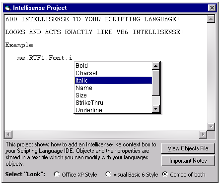



## Add Intellisense to your Scripting Language

### Description

This project shows how you can add an Intellisense List (like the one in VB where you type an object name, then a "DOT", and then a list pops up -- that's the Intellisense List). Designed to allow you to enter in YOUR SCRIPTING LANGUAGE COMMANDS AND OBJECTS quickly and easily (using an external text file). All efforts were made to make this act exactly as the one in VB does. Press TAB or ENTER to select an item in the list. Clicking TAB immediately automatically selects the first item in the list. You can begin typing the property name and the "closest match" will be highlighted as you type. Backspacing on your typed entry also does the same. Multiple "DOTS" (eg: me.text1.font.) works. Insertion of "DOT" characters in the middle of a string works. Location of intellisense box goes to where it can fit in view (bottom right, bottom left, top right, top left) depending on where your current cursor location is. This project Took me some time troubleshooting, so I hope some of you out there can use this.

UPDATED ON AUGUST 9th!

Fixed a few unhandled errors, added more comments to help you see what is happening, Wrapped Intellisense core functions into subs for easier include in your projcets, and added the ability for different styles of the Intellisense box (Office XP stlye, VB6 style, and a hybrid style) as many of you have requested.
 
### More Info
 

             |
---                |---
**Submitted On**   |2001-08-09 10:56:54
**By**             |[Anthony Awx](https://github.com/Planet-Source-Code/PSCIndex/blob/master/ByAuthor/anthony-awx.md)
**Level**          |Advanced
**User Rating**    |4.9 (128 globes from 26 users)
**Compatibility**  |VB 5\.0, VB 6\.0
**Category**       |[Miscellaneous](https://github.com/Planet-Source-Code/PSCIndex/blob/master/ByCategory/miscellaneous__1-1.md)
**World**          |[Visual Basic](https://github.com/Planet-Source-Code/PSCIndex/blob/master/ByWorld/visual-basic.md)
**Archive File**   |[Add Intell24329892001\.zip](https://github.com/Planet-Source-Code/anthony-awx-add-intellisense-to-your-scripting-language__1-25988/archive/master.zip)

